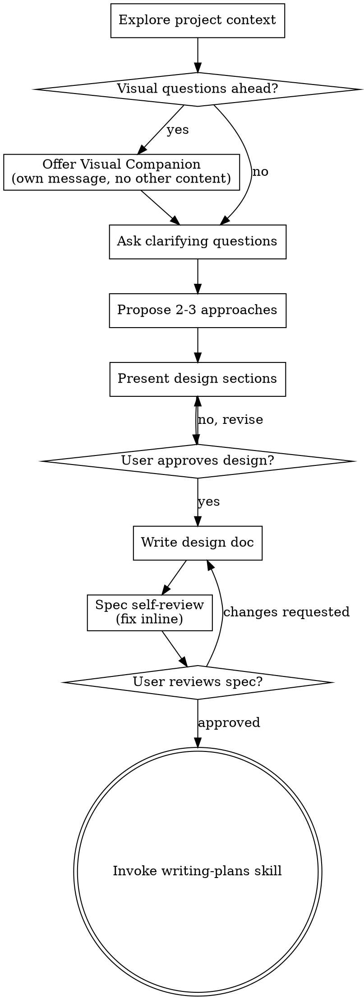

# 把想法梳理成设计

通过自然的协作对话，把想法转化为完整的设计和规格说明。

先理解当前项目上下文，然后一次只问一个问题来细化想法。理解要构建的内容后，展示设计并获得用户批准。

<HARD-GATE>
在展示设计并获得用户批准前，不要调用任何实现类技能，不要写代码，不要搭建项目，也不要执行任何实现动作。无论项目看起来多简单，这条都适用。
</HARD-GATE>

## 反模式：“这太简单了，不需要设计”

每个项目都要走这个流程。待办清单、单函数工具、配置变更都一样。“简单”项目最容易因为未经检验的假设浪费时间。设计可以很短，真正简单的项目几句话即可，但必须展示并获得批准。

## 检查清单

必须为下列每一项创建任务，并按顺序完成：

1. **探索项目上下文** — 检查文件、文档、近期提交
2. **提供可视化伴随工具**（如果主题涉及视觉问题）— 单独发一条消息，不要和澄清问题混在一起。见下方“可视化伴随工具”。
3. **提出澄清问题** — 一次一个，理解目的、约束和成功标准
4. **提出 2-3 个方案** — 说明取舍和推荐方案
5. **展示设计** — 按复杂度分段展示，每段后获得用户批准
6. **编写设计文档** — 保存到 `docs/superpowers/specs/YYYY-MM-DD-<topic>-design.md` 并提交
7. **规格自查** — 快速内联检查占位符、矛盾、歧义和范围（见下方）
8. **用户审阅已写好的规格** — 继续前请用户审阅规格文件
9. **转入实现** — 调用 writing-plans 技能创建实现计划

## 流程图

**终态是调用 writing-plans。** 不要调用 frontend-design、mcp-builder 或任何其他实现类技能。brainstorming 之后唯一调用的技能是 writing-plans。

## 流程

**理解想法：**

- 先查看当前项目状态（文件、文档、近期提交）
- 在提出细节问题前先评估范围：如果请求包含多个独立子系统（例如“构建一个带聊天、文件存储、计费和分析的平台”），立即指出。不要继续追问一个本应先拆分项目的细节。
- 如果项目太大，无法用单个规格承载，帮助用户拆成子项目：哪些部分独立、它们如何关联、应该按什么顺序构建。然后按正常设计流程梳理第一个子项目。每个子项目都有自己的规格 → 计划 → 实现周期。
- 对范围合适的项目，一次只问一个问题来细化想法。
- 尽量使用多选问题，开放式问题也可以。
- 每条消息只问一个问题；如果一个主题需要更多探索，把它拆成多个问题。
- 聚焦理解：目的、约束、成功标准。

**探索方案：**

- 提出 2-3 个不同方案及取舍。
- 用对话方式展示选项，并给出推荐和理由。
- 先给推荐方案，再解释原因。

**展示设计：**

- 当你认为已经理解要构建什么后，展示设计。
- 每个部分按复杂度调整长度：简单内容几句话即可，复杂内容最多约 200-300 词。
- 每段后询问目前是否正确。
- 覆盖：架构、组件、数据流、错误处理、测试。
- 如果某处不清楚，随时回到澄清阶段。

**为隔离和清晰而设计：**

- 把系统拆成更小的单元，每个单元有清晰目的，通过明确接口通信，并且能独立理解和测试。
- 对每个单元，都应能回答：它做什么、如何使用、依赖什么？
- 不读内部实现能否理解它做什么？修改内部实现会不会破坏调用方？如果不能，边界还需要调整。
- 小而边界清晰的单元也更容易处理。你能更好地推理可一次放进上下文的代码，文件聚焦时编辑也更可靠。文件变大通常意味着它承担了太多职责。

**在现有代码库中工作：**

- 提议变更前先探索当前结构。遵循现有模式。
- 如果现有代码的问题会影响本次工作（例如文件过大、边界不清、职责纠缠），把有针对性的改进纳入设计。这是优秀开发者在工作中改善代码的方式。
- 不要提出无关重构。始终聚焦服务当前目标的内容。

## 设计之后

**文档：**

- 将确认过的设计（规格）写入 `docs/superpowers/specs/YYYY-MM-DD-<topic>-design.md`
  - 用户对规格位置的偏好优先于默认位置。
- 默认使用用户当前沟通语言编写规格文档；如果用户用中文交流，规格文档写成中文。命令、路径、代码标识符和 API 名称保留原文。
- 如果可用，使用 elements-of-style:writing-clearly-and-concisely 技能。
- 将设计文档提交到 git。

**规格自查：**
写完规格文档后，用全新视角检查：

1. **占位符扫描：** 是否有 “TBD”、“TODO”、未完成章节或模糊需求？修掉。
2. **内部一致性：** 各部分是否互相矛盾？架构是否匹配功能描述？
3. **范围检查：** 是否足够聚焦，能进入单个实现计划？还是需要拆分？
4. **歧义检查：** 是否有需求可能被两种方式理解？如果有，选择一种并写明确。

发现问题就内联修复。不需要重新审阅，修好后继续。

**用户审阅门禁：**
规格审阅循环通过后，请用户在继续前审阅已写好的规格：

> "规格已写入并提交到 `<path>`。请审阅一下，如果在开始编写实现计划前需要修改，请告诉我。"

等待用户响应。如果用户要求修改，完成修改并重新执行规格审阅循环。只有用户批准后才继续。

**实现：**

- 调用 writing-plans 技能创建详细实现计划。
- 不要调用其他技能。下一步只能是 writing-plans。

## 核心原则

- **一次一个问题** - 不要用多个问题压垮用户
- **优先多选** - 可行时比开放问题更容易回答
- **严格 YAGNI** - 从所有设计中移除不必要功能
- **探索替代方案** - 确定前始终提出 2-3 个方案
- **增量确认** - 展示设计，获得批准后再继续
- **保持灵活** - 不合理时回头澄清

## 可视化伴随工具

一个基于浏览器的辅助工具，用于在头脑风暴过程中展示 mockup、图表和视觉选项。它是工具，不是模式。接受该工具只表示在适合视觉展示的问题中可以使用它；不表示每个问题都要走浏览器。

**提供伴随工具：** 当你预期接下来的问题会涉及视觉内容（mockup、布局、图表）时，先询问一次是否同意：
> "我们接下来要处理的一些内容，如果能在浏览器里展示，可能更容易说明。我可以边讨论边做 mockup、图表、对比和其他视觉材料。这个功能还比较新，也可能消耗较多 token。要试试吗？（需要打开一个本地 URL）"

**这个询问必须单独成一条消息。** 不要和澄清问题、上下文总结或任何其他内容合并。消息中只能包含上面的询问。等待用户回复后再继续。如果用户拒绝，就用纯文本继续头脑风暴。

**逐问题判断：** 即使用户接受，也要对每个问题单独判断使用浏览器还是终端。判断标准：**用户看到它会不会比读文字更容易理解？**

- **对视觉内容使用浏览器** — mockup、线框图、布局对比、架构图、并排视觉设计
- **对文本内容使用终端** — 需求问题、概念选择、取舍列表、A/B/C/D 文本选项、范围决策

关于 UI 的问题不自动等于视觉问题。“这里的个性是什么意思？”是概念问题，使用终端。“哪种向导布局更好？”是视觉问题，使用浏览器。

如果用户同意使用伴随工具，继续前先阅读详细指南：
`skills/brainstorming/visual-companion.md`
